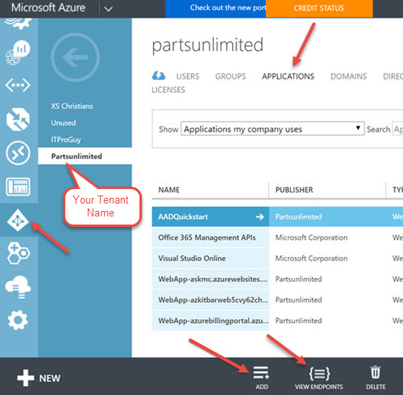
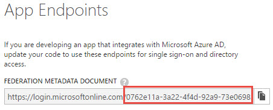

# Setup Azure Active Directory for AzureBot Development

If you would like to authenticate against your own Azure AD for development or private use of the AzureBot code, you'll need to setup your own Azure AD application.  Here are the steps you need to follow:
 
1. [Create or Utilize an Azure Active Directory (AAD) Tenant](#tenant)
2. [Create a new Azure AD app on the AAD tenant](app)
3. [Configure the AAD application for use with the AzureBot](#configureapp)
4. [Configure App Multi-Tenancy (optional)](#configuremulti)

## 1. Create or Utilize an Azure Active Directory (AAD) Tenant
* You will need to create a new AAD application via the classic portal or via PowerShell.  To complete these steps, please [see this article](https://azure.microsoft.com/en-us/documentation/articles/active-directory-howto-tenant/).
* Once it's created, get the Tenant ID by going to the [classic Azure portal](http://manage.windowsazure.com), select the Azure AD resource, and click on the view endpoints button.
 
* Note the tenant ID is the number after the **microsoftonline.com/** text (example is inside the red box with the full number continuing past the 98 at the end).
  

## 2. Create a new Azure AD app on the AAD tenant

 * In the same location as the previous step, click on add a new application.  
 
 * Select Add an application my organization is developing
 * Pick any name you want and select Web Application / Web API radio button
 * For both URLs pick the base domain name where you publish your Bot code to and then add /api/messages.  i.e. https://_mycustomsite_.azurewebsites.net/api/messages

> Note: If you plan to make your app multi-tenant enabled, you'll need to use a public domain name and get a corresponding SSL certificate.  See step 4 for more information.  You would then use something like https://_mycustomdomain.com_/api/messages instead.

## 3. Configure the AAD application for use with the AzureBot
Go to the configure tab of the application you just created and do the following:

 * Save the *Client ID* value. You will need this for the AzureBot development
 * Select duration for a key and click save.  Securely save the application secret key displayed on the screen - you will also need this for AzureBot Development.  You won't get access to this key again.
 * Add and save these two Reply URLs as follows:  https://_mycustomsite_.azurewebsites.com/api/OAuthCallback
  https://localhost/api/OAuthCallback
 * Click on the green Add permissions to other applications button.  Select Windows Service Management API and check the checkbox.
 * Select Delegated Permissions and click the checkbox to "Access Azure Service Management..."
   

## 4. Configure App Multi-Tenancy (optional)
 If you want the AzureBot deployment using this application to be able to access Azure subscriptions other than ones which are directly under management of the Azure AD tenant where the application resides, then you will need to enable the application to be multi-tenant.  In order to make this work, you have to do the following:
 
* Own a custom domain name and corresponding SSL certificate which is assigned to where your bot code is deployed.  This should match in all of the places where you configured https URLs from the above steps.
* In the domains tab of your AAD tenant in the classic portal, add in the domain name you own and verify it
* In the AAD application you configured for the bot, go into the configure tab and select "Yes" for the "Application is Multi-Tenant" setting.
