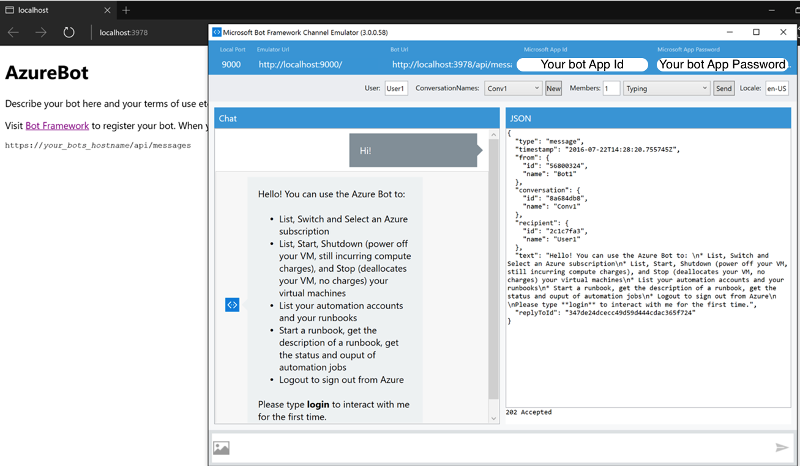

# Developer Setup

## Overview

If you would like to contribute to the Azure Bot or run it on your own environment, these instructions will help you get set up. 

The solution was created using [Visual Studio 2015 Update 2](https://www.visualstudio.com/en-us/news/vs2015-update2-vs.aspx). It was built with the [Microsoft Bot framework](http://docs.botframework.com/) and the [Microsoft Bot Builder C# SDK](http://docs.botframework.com/sdkreference/csharp/). It uses the [Azure Resource Manager Nuget package](https://www.nuget.org/packages/Microsoft.Azure.Management.ResourceManager) and other Azure packages.

Here are the steps you need to follow:<br>
1. [LUIS Model (Optional)](#luis)<br>
2. [Azure Active Directory](#azuread)<br>
3. [Register a Bot with the Bot Framework](#registerbot)<br>
4. [Bot Framework Emulator](#emulator)<br>
5. [Putting it all Together](#glue)<br>

<a name="luis"></a>
## 1. LUIS Model (Optional)

AzureBot uses [Language Understanding Intelligent Service (LUIS)](https://www.luis.ai), a part of [Microsoft Cognitive Services](https://www.microsoft.com/cognitive-services/), to understand the user's intent. 

The AzureBot code in this repo has the the ***LuisModel*** attribute on the ***[ActionDialog](../AzureBot/ActionDialog.cs)*** class already configured with our LUIS model, so if you are not adding to the bot code you don't need to craete your own LUIS applicaiton.

But if you would like to develop with your own model and extend it with your additions to the bot, or want to understand how the LUIS model works, [create an account with LUIS](https://www.luis.ai). Then create a new application using New App -> Import Existing App. Then, in this new app dialog box, upload the [AzureBot.json file](../AzureBot/LuisModel/AzureBot.json).   

Once you have created the new LUIS application, train and [publish it](https://www.luis.ai/Help/#PublishingModel), then update the ***LuisModel*** attribute in the ***[ActionDialog](../AzureBot/ActionDialog.cs)*** class with the new application ID and subscription key. You can get the application ID and subscription key from the LUIS application published URL.

<a name="azuread"></a>
## 2. Azure Active Directory

To authenticate against your own Azure AD for development or private use of the AzureBot code, you'll need to setup your own Azure AD application. Follow our [Azure AD instructions](/CreateAzureADforAzureBot.md) to get it set up and take note of the tenant, client id and client secret values for it.

<a name="registerbot"></a>
## 3. Register a Bot with the Bot Framework 

You will also need a bot entry in the Bot Framework. You can do this from the [Bot Framework developer portal](https://dev.botframework.com/bots/new).

Once you have created your bot, follow the [***Step 1. Get your App ID and password from the Developer Portal***](https://docs.botframework.com/en-us/support/upgrade-to-v3/#case-1-there-is-an-app-id-already)  instruction and take not of the bot handle, bot app id and bot app password.

<a name="emulator"></a>
## 4. Bot Framework Emulator

If you would like to run the bot locally from Visual Studio and test it, the Bot Framework Emulator is required.

Follow the [instructions to install the Bot Framework Emulator](https://docs.botframework.com/en-us/tools/bot-framework-emulator/) on your development environment. 

<a name="glue"></a>
## 5. Putting it all Together

Now that you have a LUIS application, an Azure Active Directory tenant, a registered bot, and have installed the Bot Framework Emulator, you can run your bot locally and use the emulator to interact with your bot, or even deploy it to your own web host like an Azure Web App to run it.

The first step is to update the values in ***[web.config](../AzureBot/web.config)*** of the AzureBot project in the appSettings section:

```XML
  <appSettings>
    <!-- update these with your Bot Id, Microsoft App Id and your Microsoft App passwords -->
    <add key="BotId" value="***YOUR-BOT-ID***" />
    <add key="MicrosoftAppId" value="YOUR-MICROSOFT-APP-ID" />
    <add key="MicrosoftAppPassword" value="YOUR-MICROSOFT-APP-PASSWORD" />

    <!-- Authentication settings -->
    <add key="ActiveDirectory.Mode" value="v1" />
    <add key="ActiveDirectory.ResourceId" value="https://management.core.windows.net/" />
    <add key="ActiveDirectory.EndpointUrl" value="https://login.microsoftonline.com" />
    <add key="ActiveDirectory.Tenant" value="YOUR-TENANT" />
    <add key="ActiveDirectory.ClientId" value="YOUR-CLIENT-ID" />
    <add key="ActiveDirectory.ClientSecret" value="YOUR-CLIENT-SECRET" />
    <add key="ActiveDirectory.RedirectUrl" value="YOUR-REDIRECT-URL" />

    <!-- Azure ARM settings -->
    <add key="ResourceManager.EndpointUrl" value="https://management.azure.com/" />
  </appSettings>
```

You need to replace the value of the following keys:
Key | Replacement Notes
--- | -----------------
**BotId** | the bot handle for your new bot
**MicrosoftAppId** | the App Id of your bot
**MicrosoftAppPassword** | The Password for your bot 
**ActiveDirectory.Tenant** | your AD Tenant
**ActiveDirectory.ClientId** | your AD client ID
**ActiveDirectory.ClientSecret** | your AD client secret
**ActiveDirectory.RedirectUrl** | for local dev set to http://localhost:3978/api/OAuthCallback

***Note: Careful to NOT git commit the bot and AD values, as they will then be public once you sync with GitHub. Always revert it back to the placeholder values before a commit. We will be moving these values out of web.config to help avoid this in the future***
 
Finally, start a new instance of the AzureBot project from Visual Studio. Then start the bot emulator app, and configure the emulator with the same App Id and App Password as per ***web.config***. From then you can interact with the bot using the Emulator. You can set breakpoints in your code in Visual Studio to see how it works. Here’s a printscreen:

